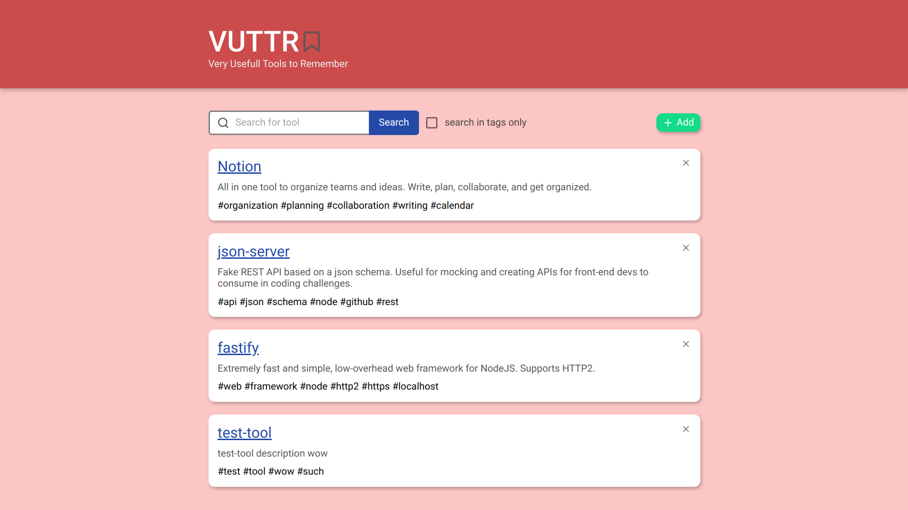

<h1 align="center">Very Usefull Tools to Remember</h1>

<h3 align="center">Remember what actually matters!<h3>

## 📷 Preview




---

## 📜 About the project
<p>This project is about saving all the tools you may consider usefull in only one place. Nothing really innovative, but it was quite fun to do it. </p>

<p>This is a challenge made by <a href="https://app.bossabox.com">BossaBox</a>. The idea was to do a layout that consumes an external API following some rules and instructions. You can find the fake API to consume <a href="https://gitlab.com/bossabox/challenge-fake-api/tree/master">here</a>.</p>

I have used this project to improve my ReactJS skills and learn how to prototype a layout. I have used [figma](https://www.figma.com/) for the prototype and it can be found [here](https://www.figma.com/file/F0dWLzpKyocZYBIxAAPmur/VUTTR?node-id=0%3A1).

## 📑 Technologies
- [ReactJS](https://pt-br.reactjs.org/)
- [Typescript](https://www.typescriptlang.org/index.html)
- [React Router DOM](https://reactrouter.com/web/guides/quick-start)
- [Styled Components](https://styled-components.com/)
- [Axios](https://github.com/axios/axios)
- [UnForm](https://github.com/Rocketseat/unform)

## 📦 Getting Started
### Requirements
- Already have [Node.js](https://nodejs.org/en/) installed.
- [yarn](https://yarnpkg.com/) or [npm](https://www.npmjs.com/) for package manegement.

### Installing

```bash
# Clone repository
$ git clone https://github.com/lcastrof/vuttr-frontend

# Access directory
$ cd vuttr-frontend

# Install dependencies
$ yarn install
```

### Running
First you need to be sure the file 'src/services/api.ts' have the address to your API. Then, run:
```bash
$ yarn start
```

---
Developed by Lucas de Castro Fernandino
